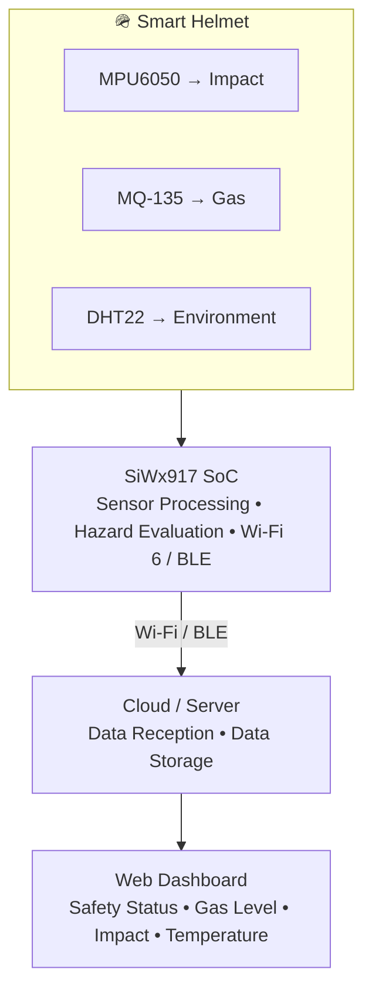
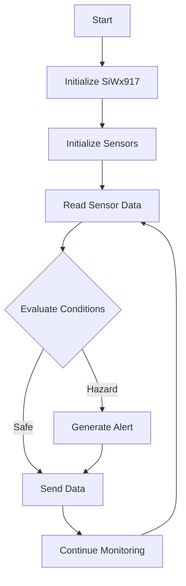
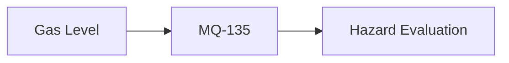
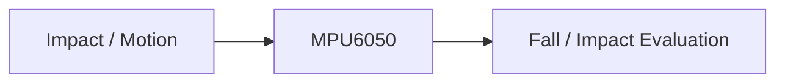
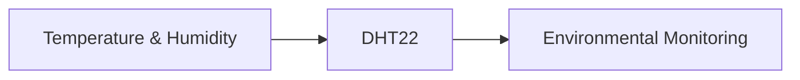
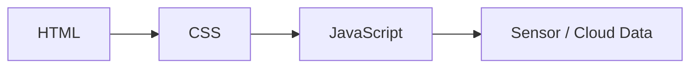
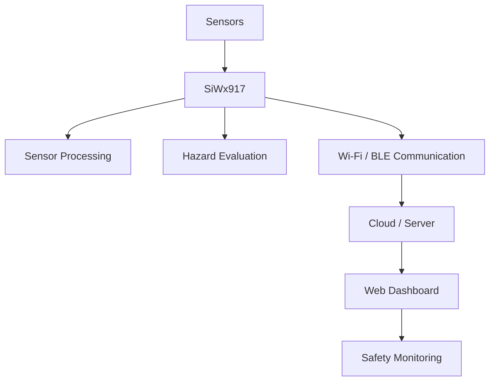
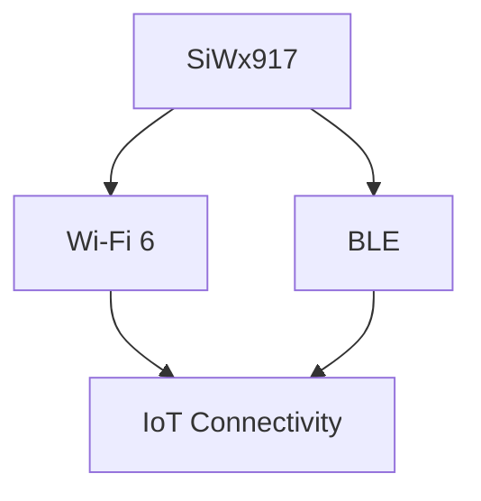

# 🪖 IoT Smart Helmet — Industrial Worker Safety Monitoring System

## Overview

The **IoT Smart Helmet** is an embedded worker-safety monitoring system designed for industrial environments where workers may be exposed to **gas leakage, excessive temperature, and accidental impacts or falls**.

The system integrates multiple sensors with the **Silicon Labs SiWx917 Wi-Fi 6 + Bluetooth LE platform** to collect safety-related information, process sensor data, evaluate hazardous conditions, and transmit safety information wirelessly.

A web-based dashboard provides a centralized interface for monitoring helmet status and sensor information.

## Key Features

* 🛡️ Worker Safety Monitoring
* 💥 Impact and Fall Detection
* 🌫️ Gas-Level Monitoring
* 🌡️ Temperature and Humidity Monitoring
* 📡 Wi-Fi 6 Connectivity
* 🔵 Bluetooth Low Energy (BLE)
* ☁️ Cloud/Data Communication
* 📊 Web-Based Monitoring Dashboard
* ⚡ Edge-Based Sensor Processing
* 🚨 Hazard Status Evaluation

## Hardware Platform

* **Silicon Labs SiWx917 BRD2605A** — Main controller and wireless communication platform
* **MPU6050** — Accelerometer and gyroscope for impact and motion detection
* **MQ-135** — Gas and air-quality monitoring
* **DHT22** — Temperature and humidity measurement
* **Li-ion Battery** — Portable power source
* **Smart Helmet** — Physical safety platform

## Technologies Used

* Embedded C
* Python
* Wi-Fi 6
* Bluetooth Low Energy (BLE)
* REST API
* HTML
* CSS
* JavaScript
* SiWx917 SDK / Development Tools

## System Architecture



## Hardware Components

| Component                         | Purpose                                                   |
| --------------------------------- | --------------------------------------------------------- |
| **Silicon Labs SiWx917 BRD2605A** | Main controller, Wi-Fi 6 and BLE connectivity             |
| **MPU6050**                       | Accelerometer / gyroscope for impact and motion detection |
| **MQ-135**                        | Gas and air-quality monitoring                            |
| **DHT22**                         | Temperature and humidity measurement                      |
| **Li-ion Battery**                | Portable power source                                     |
| **Smart Helmet**                  | Physical worker-safety platform                           |

## Software & Technologies

| Technology                          | Usage                              |
| ----------------------------------- | ---------------------------------- |
| **C**                               | Embedded firmware                  |
| **Python**                          | Cloud/data communication           |
| **HTML**                            | Dashboard structure                |
| **CSS**                             | Dashboard styling                  |
| **JavaScript**                      | Dashboard interaction              |
| **Wi-Fi 6**                         | Wireless communication             |
| **Bluetooth LE**                    | Short-range wireless communication |
| **REST API**                        | Data transmission architecture     |
| **SiWx917 SDK / Development Tools** | Embedded development               |

## Project Structure

```text
IoT-Smart-Helmet/
│
├── 📁 firm/
│   └── main.c
│
├── 📁 cloud/
│   ├── data_uploader.py
│   └── firebase_config.json
│
├── 📁 dashboard/
│   ├── index.html
│   ├── script.js
│   └── style.css
│
├── 📦 Industry-based-Smart-Helmet.zip
│
└── 📄 README.md
```

## Firmware Architecture

The embedded firmware follows a continuous monitoring cycle:



## Hazard Detection

The system evaluates multiple sensor parameters to determine the current safety condition of the worker.

### Gas Monitoring



### Impact / Fall Detection



### Environmental Monitoring



The resulting safety condition can be classified into:

```text
🟢 SAFE
🟡 WARNING
🔴 HAZARD
```

## Cloud Data Flow

Sensor information is structured before being transmitted to the cloud layer.

Example sensor data:

```json
{
  "helmet_id": "HLT_01",
  "gas_level": 145,
  "impact_force": 2.8,
  "temperature": 33.2,
  "status": "SAFE"
}
```

The repository includes a Python-based uploader for demonstrating the cloud communication layer.

> **Note:** The current repository contains prototype/simulated cloud communication. The placeholder cloud endpoint should be replaced with the actual deployment server or Firebase endpoint before production use.

## Web Dashboard

The web dashboard provides a centralized interface for monitoring the smart helmet.

### Dashboard Parameters

* 🪖 Helmet ID
* 🟢 Current Safety Status
* 🌫️ Gas Level
* 💥 Impact Force
* 🌡️ Temperature

The dashboard uses:



## Complete Data Flow



## Current Prototype Status

| Module                       | Status               |
| ---------------------------- | -------------------- |
| SiWx917 Development Platform | 🟢 Implemented       |
| Sensor Architecture          | 🟢 Defined           |
| MPU6050 Integration          | 🟡 Prototype         |
| MQ-135 Integration           | 🟡 Prototype         |
| DHT22 Integration            | 🟡 Prototype         |
| Firmware Architecture        | 🟡 Prototype         |
| Cloud Communication          | 🟡 Prototype         |
| Web Dashboard                | 🟢 Implemented       |
| End-to-End Deployment        | 🔵 Under Development |

> 🟢 Implemented    🟡 Prototype    🔵 Under Development

## Applications

The IoT Smart Helmet can be adapted for:

* 🏭 Manufacturing Industries
* ⛏️ Mining Environments
* 🏗️ Construction Sites
* 🧪 Chemical Industries
* ⚡ Industrial Maintenance
* 🚧 Hazardous Work Zones

## Future Enhancements

The prototype can be extended with:

* 🚨 Emergency SOS Button
* 📍 GPS-Based Worker Location
* 📱 Mobile Notifications
* 🔔 Buzzer / Vibration Alerts
* 📈 Historical Sensor Analytics
* ☁️ Real-Time Cloud Database
* 🤖 ML-Based Accident Prediction
* 🔋 Battery-Level Monitoring
* 👷 Worker Identification
* 📡 OTA Firmware Updates

## Project Highlights

### Why SiWx917?

The **Silicon Labs SiWx917** provides an integrated wireless platform combining **Wi-Fi 6 and Bluetooth LE** capabilities.



This integrated wireless capability allows the smart helmet to communicate with connected systems without requiring separate Wi-Fi and Bluetooth controllers.

## Project Information

**Project:** IoT Smart Helmet – Industrial Worker Safety Monitoring System

## Maintainers / Contacts

| Name             | Role           | Contact                                                             |
| ---------------- | -------------- | ------------------------------------------------------------------- |
| Arjun V          | Developer      | [arjunvasanthakumar@gmail.com](mailto:arjunvasanthakumar@gmail.com) |
| Harish Kumar S   | Developer      | [S-harishkumarsoffl@gmail.com](mailto:S-harishkumarsoffl@gmail.com) |
| Kavya Sri R      | Developer      | [kavyasrirdofficial@gmail.com](mailto:kavyasrirdofficial@gmail.com) |
| Samhita M        | Developer      | [samhitamanikandan@gmail.com](mailto:samhitamanikandan@gmail.com)   |
| Shree Varsha R K | Developer      | [shreevarshark@gmail.com](mailto:shreevarshark@gmail.com)           |
| Sridharshini K   | Developer      | [sdmithu24@gmail.com](mailto:sdmithu24@gmail.com)                   |
| Jaikumar R       | Faculty Mentor |                                                                     |


**Institution:** KPR Institute of Engineering and Technology (KPRIET)

**Domain:** Embedded Systems • IoT • Wireless Communication • Industrial Safety

## 📜 License

This project is developed for the Silicon Labs Centre of Innovation in IoT Program.
